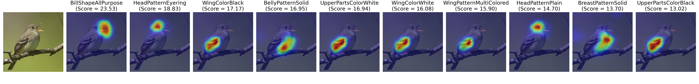
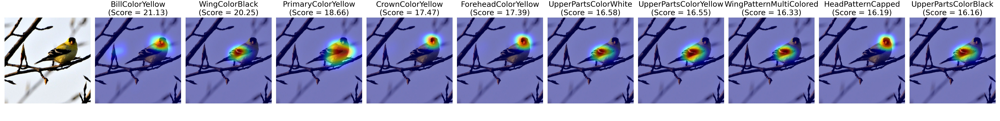
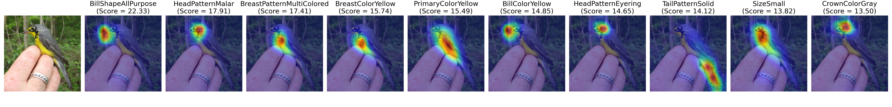
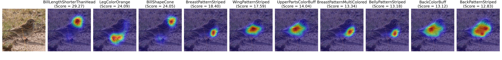
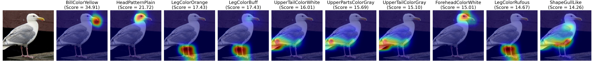
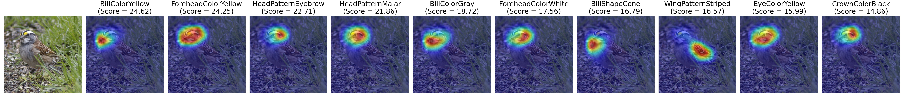
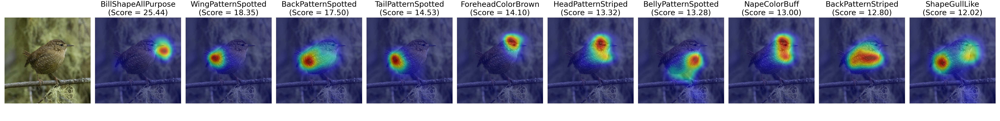
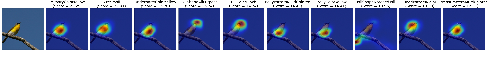

# TransZero


This is anonymous project website of the paper "*TransZero: Attribute-guided Transformer for Zero-Shot Learning*" submitted to AAAI 2022. Note that this repository includes the following materials for testing and checking our results reported in our paper:

1. The trained model
2. The test scripts
3. The t-SNE visualization of visual features on SUN and AWA2.  
4. More visualization of attention maps. 

**Once our paper is accepted, we will release all codes of this work**.


# Usage of Testing Codes
## Preparing Dataset and Model

We provide trained models ([Google Drive](https://drive.google.com/drive/folders/1WK9pm2eX2Rl4rWqXqe_EZiAM8wWB8yqG?usp=sharing)) on three different datasets: [CUB](http://www.vision.caltech.edu/visipedia/CUB-200-2011.html), [SUN](http://cs.brown.edu/~gmpatter/sunattributes.html), [AWA2](http://cvml.ist.ac.at/AwA2/) in the CZSL/GZSL setting. You can download model files as well as corresponding datasets, and organize them as follows: 
```
.
├── saved_model
│   ├── TransZero_CUB_CZSL.pth
│   ├── TransZero_CUB_GZSL.pth
│   ├── TransZero_SUN_CZSL.pth
│   ├── TransZero_SUN_GZSL.pth
│   ├── TransZero_AWA2_CZSL.pth
│   └── TransZero_AWA2_GZSL.pth
├── data
│   ├── CUB/
│   ├── SUN/
│   └── AWA2/
└── ···
```

## Requirements
The code implementation of **TransZero** mainly based on [PyTorch](https://pytorch.org/). All of our experiments run and test in Python 3.8.8. To install all required dependencies:
```
$ pip install -r requirements.txt
```
## Runing
Runing following commands and testing **TransZero** on different dataset:

CUB Dataset: 
```
$ python test.py --config config/CUB_CZSL.json      # CZSL Setting
$ python test.py --config config/CUB_GZSL.json      # GZSL Setting
```
SUN Dataset:
```
$ python test.py --config config/SUN_CZSL.json      # CZSL Setting
$ python test.py --config config/SUN_GZSL.json      # GZSL Setting
```
AWA2 Dataset: 
```
$ python test.py --config config/AWA2_CZSL.json     # CZSL Setting
$ python test.py --config config/AWA2_GZSL.json     # GZSL Setting
```

## Results
Results of our released models using various evaluation protocols on three datasets, both in the conventional ZSL (CZSL) and generalized ZSL (GZSL) settings.

| Dataset | U | S | H | Acc |
| :-----: | :-----: | :-----: | :-----: | :-----: |
| CUB | 69.3 | 68.3 | 68.8 | 76.8 |
| SUN | 52.6 | 33.4 | 40.8 | 65.6 |
| AWA2 | 61.3 | 82.3 | 70.2 | 70.1 |

**Note**: All of above results are run on a server with an AMD Ryzen 7 5800X CPU and one Nvidia RTX A6000 GPU.

<!-- ## References -->

# Visualization Results
To intuitively show the effect our method for attribute localization, we provide more attention maps. 

(For each row, image #1 is the original figure, image #2-#11 are the top-10
attended attribute maps)











